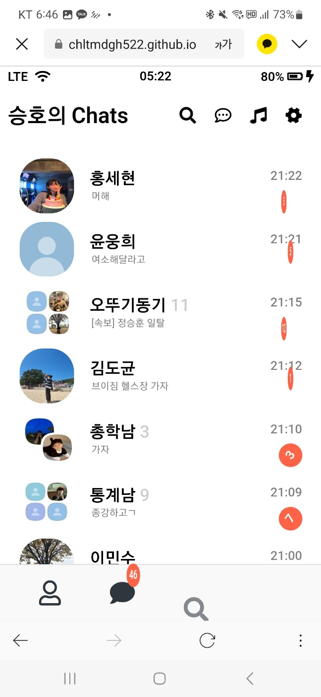
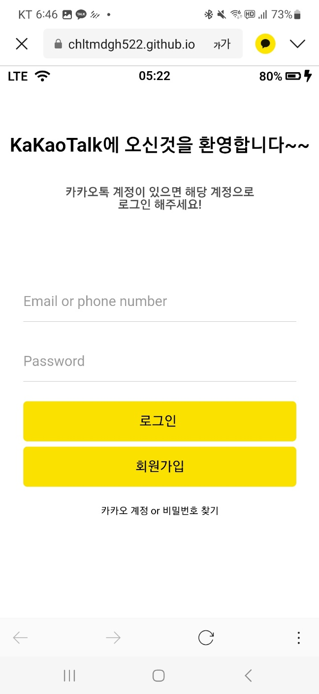
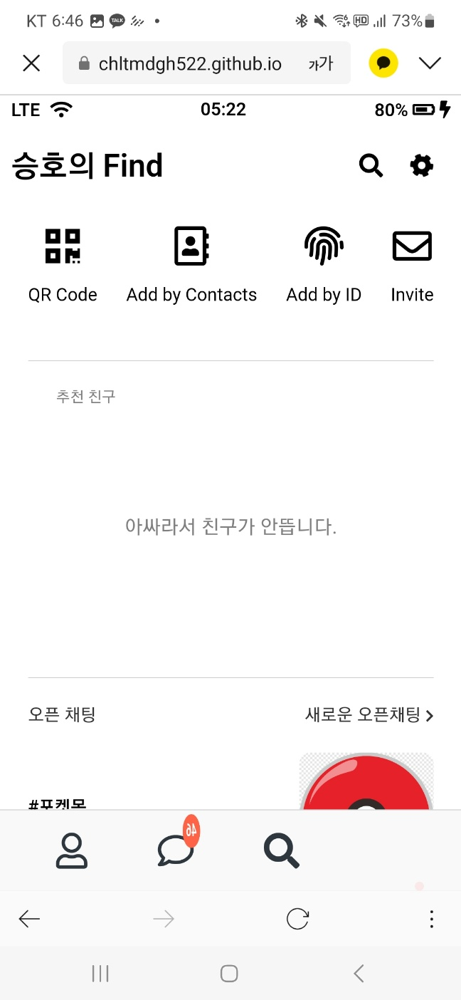
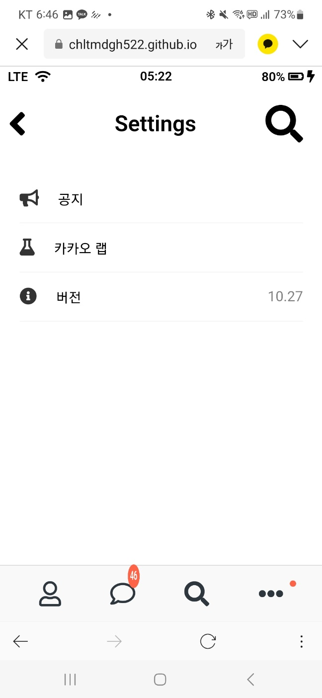
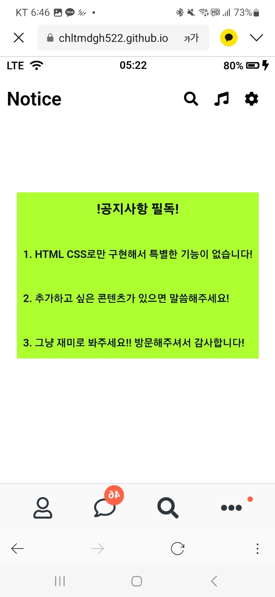
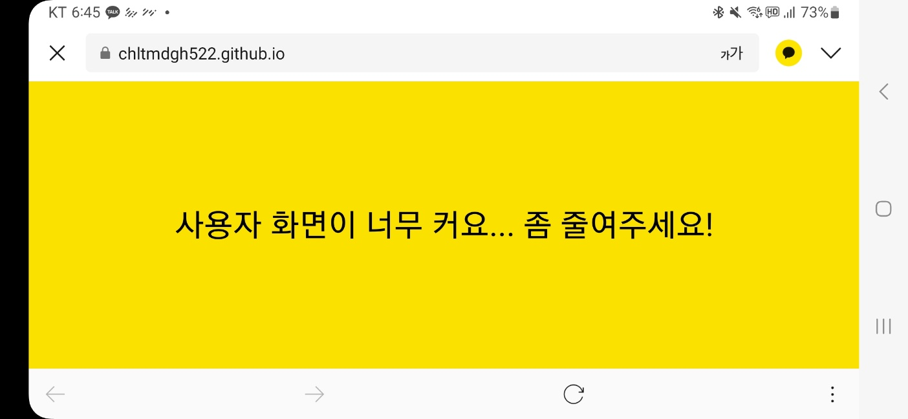

# KaKapTalk_Project

> 카카오톡 클론 프로젝트  
> https://chltmdgh522.github.io/KaKaoTalk_Project/

 

## 1. 제작 기간

- 2023/04/27 ~ 2023/06/28

 

## 2. 사용 기술

- HTML5
- CSS

 

## 3. 프로젝트 목표

- HTML/CSS 익히기
- HTML/CSS를 활용한 프로젝트 만들기
- CSS 에니메이션 익히기
- 첫 깃허브 페이지 만들기

 

## 4. 주요 기능

- 구현
  - chats.html, find.html, friends.html, index.html, more.html, notice.html 전체적인 구조 만들기
  - HTML form을 통한 로그인
  - CSS 적극 에니메이션 구현
  - JS를 이용한 이모티콘 구현
  - CSS 구조와 초기화 구현
  - 일정 화면 비율보다 크면 특정 화면 보여주기 구현

 

## 5. 주요 화면

    
    
    
    
    
    
    
    

